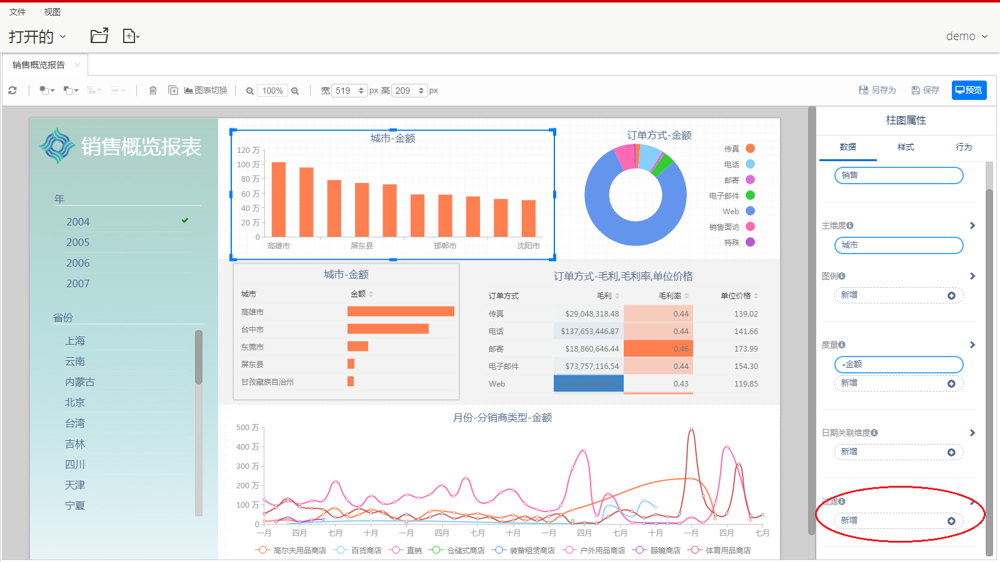

### 组件数据过滤器

组件的数据过滤是将组件不需要显示的数据过滤掉，优化或减少组件背后的数据。
您可以将一个或多个维度字段添加的“数据面板”的“过滤框，设置维度字段的过滤条件。

**多个过滤器**
一个组件可以具有多个过滤器。在这种情况下，每个过滤器都被视为AND子句。这意味着仅满足过滤器中所有条件的数据行将受到影响。

**过滤方式有2种：**
- 包含过滤器仅检索符合条件的记录。
- 排除过滤器仅检索不符合条件的记录。

**过滤器类型：**
- 文本过滤器
	- 基本过滤，在列表中选择过滤项
	- 高级过滤，通过or或者and组合多个文本过滤条件。文本过滤条件包括：“包含”、“不包含”、“前置”，“后缀”。
- 日期过滤器
	- 基本过滤，在列表中选择日期
	- 相对日期过滤，选择系统提供的相对过滤条件，实现动态日期过滤
	- 高级过滤，通过or或者and组合多个日期过滤条件。日期过滤条件包括：“之前”、“等于”、“之后”。

### 创建过滤器
向图表或控件添加过滤器
1. 编辑页面。
2. 选择要过滤的图表或控件。
3. 在“属性”面板中选择“数据”选项卡。
4. 在“过滤”框中“新增”添加过滤器。
5. 在模型中选择过滤字段。
6. 选择“过滤类型”
7. 设置过滤条件
8. 点击“应用”

### 编辑过滤器
1. 编辑您的页面。
2. 选择具有过滤器的图表或控件。
3. 在“ 属性”面板中选择“ 数据”选项卡。
4. 点击过滤字段

