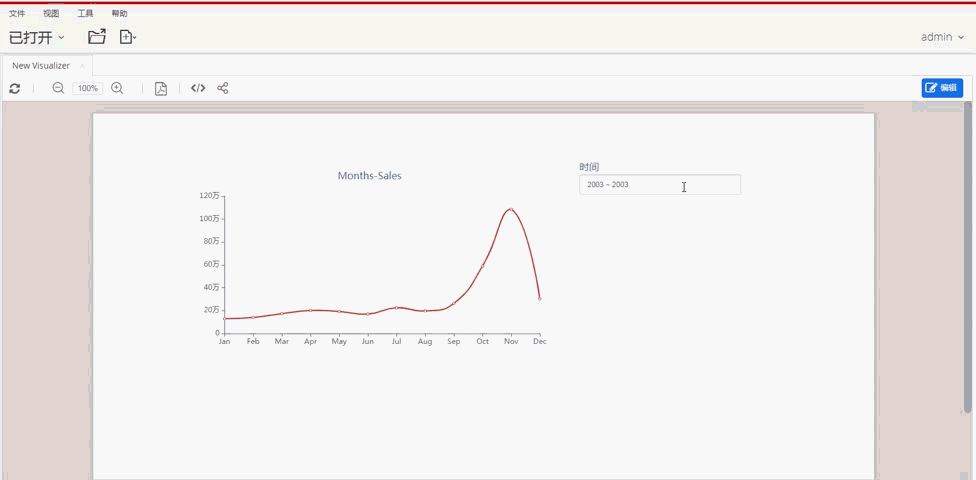

### 时间组件

“时间”组件是一个日历小控件，此控件的作用是选择时间范围，包括“天”、“月”、“年“的范围选择。

### 将时间组件添加到页面

1. 编辑页面。
2. 在组件面板的“筛选组件”中选择“时间组件”。
3. 在画布合适的位置绘制时间组件。
4. 在时间组件的属性面板的“数据”标签页设置时间组件的类型、时间字段和默认值。
5. 在样式标签页中修改时间组件样式。
6. 在行为标签页中建立其它组件和此时间组件的”订阅“关系。

### 时间组件的日历类型

在时间组件的“数据”标签页上选择一个“日历类型”：

- 天，时间组件和下拉日历显示日期范围。
- 月，时间组件和下拉日历显示月份范围。
- 年，时间组件和下拉日历显示年份范围。

### 时间组件如何工作

选择一个时间范围，或者使用预定义的选项包括诸如“昨天”，“最近7天（包括今天）”和“最后一个季度”之类的时间选项，改变时间组件的时间范围。时间组件通过设置的“时间字段”影响“时间轴”或“指定时间字段”的时间范围。

#### 时间轴

“时间轴”字段是其它数据组件的数据选项卡上设置的一个时间类型的字段。不同的数据组件可以在时间轴上设置不同的时间字段。时间组件的时间范围过滤时间轴上相同类型的时间字段的时间范围。

#### 指定时间字段

指定时间字段是分析模型上的某一个时间类型的字段。时间组件的时间范围过滤此时间字段的时间范围。

**“时间轴”**和**“指定时间字段”**比较：

| 时间字段类型 | 使用条件                 | 是否要建立订阅关系 | 应用场景                                         |
| ------------ | ------------------------ | ------------------ | ------------------------------------------------ |
| 时间轴       | 组件上设置**时间轴**字段 | 是                 | 通过一个时间组件，筛选不同的分析模型或时间字段   |
| 指定时间字段 | 时间组件指定**时间字段** | 是                 | 通过一个时间组件筛选一个分析模型上的一个时间字段 |